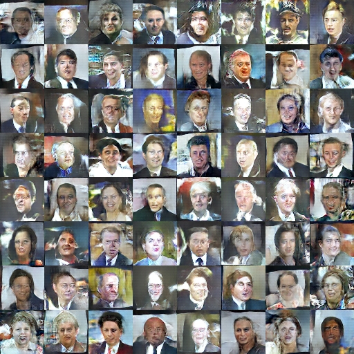

Caffe implementation of WGAN (["Wasserstein GAN"](https://arxiv.org/abs/1701.07875))
===============

## A few notes

- In this implementation we add overtraining like it's described in original code at the [lines 163-166 of main.py](https://github.com/martinarjovsky/WassersteinGAN/blob/master/main.py#L163-L166). These lines act only on the first 25 generator iterations or very sporadically (once every 500 generator iterations). In such a case, they set the number of iterations on the critic to 100 instead of the default 5. This helps to start with the critic at optimum even in the first iterations. There shouldn't be a major difference in performance, but it can help, especially when visualizing learning curves (since otherwise you'd see the loss going up until the critic is properly trained). This is also why the first 25 iterations take significantly longer than the rest of the training as well.
- Like it's described in the original implementation in pytorch [this](https://github.com/martinarjovsky/WassersteinGAN/issues/2) we find a problem when the critic fails to be close to optimum, and hence it's error stops being a good Wasserstein estimate. Known causes are high learning rates and momentum, and anything that helps the critic get back on track is likely to help with the issue. We use several learning rates (0.00005, 0.00002, 0.00001), and we can verify this problem is 

## Prerequisites

- Computer with Linux. We have use GNU/Linux Debian 9.0.
- You need a special adaptation of Caffe library you can find [this](https://github.com/juanecito/caffe/tree/new_loss_layer). This version includes two new functions used in WGAN implementation.
- For training, an NVIDIA GPU with cuDNN library is strongly recommended for speed. CPU is supported but training is very slow. We have use CUDA v8.0 and cuDNN v7.0.

Two main empirical claims:

### Generator sample quality correlates with discriminator loss


### Improved model stability


## Reproducing LFW_FACES experiments

You need to download faces data in [lw_faces](http://vis-www.cs.umass.edu/lfw/lfw-funneled.tgz)

**With DCGAN:**

```bash
./bin/wgan_release --run-wgan --log [log_file_name] --batch-size 64 \
--d-iters-by-g-iter 5 --main-iter 7800 --z-vector-bin-file [z_vector_file_name] --z-vector-size 100 \
--dataset LFW_faces --data-src-path ./bin/data/lfw_funneled --output-path [output_folder] --solver-d-model ./models/solver_d_lr_B.prototxt --solver-g-model ./models/solver_g_lr_B.prototxt --solver-d-state [output_folder]/wgan_d_iter_40000.solverstate --solver-g-state [output_folder]/wgan_g_iter_7500.solverstate
```



You can see the training result 


## Reproducing CIFAR10 (airplains) experiments

You need to download cifar10 data in [binary mode](http://www.cs.toronto.edu/~kriz/cifar-10-binary.tar.gz)

**With DCGAN:**

```bash
./bin/wgan_release --run-wgan --log wgan_faces_20170903155351/wgan_faces2.log --batch-size 64 --d-iters-by-g-iter 5 --main-iter 780 --z-vector-bin-file wgan_faces_20170903155351/z_vector.bin --z-vector-size 100 --dataset LFW_faces --data-src-path ./bin/data/lfw_funneled --output-path wgan_faces_20170903155351 --solver-d-model ./models/solver_d_lr_B.prototxt --solver-g-model ./models/solver_g_lr_B.prototxt --solver-d-state wgan_faces_20170903155351/wgan_d_iter_40000.solverstate --solver-g-state wgan_faces_20170903155351/wgan_g_iter_7500.solverstate
```

Generated samples will be in the `output-path` folder.

If you plot the value `-Loss_D`, then you can reproduce the curves from the paper. The curves from the paper (as mentioned in the paper) have a median filter applied to them:

```python
med_filtered_loss = scipy.signal.medfilt(-Loss_D, dtype='float64'), 101)
```

More improved README in the works.
